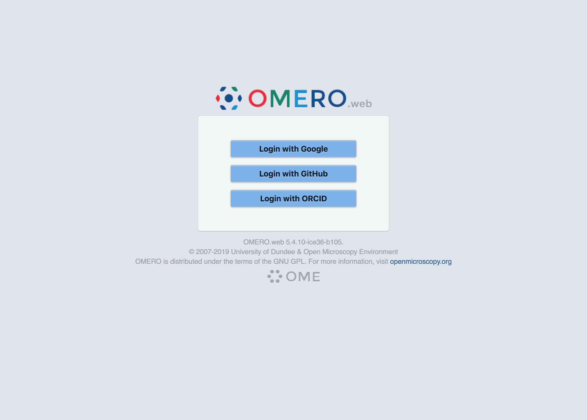

.. image:: https://travis-ci.com/manics/omero-oauth.svg?branch=master
    :target: https://travis-ci.com/manics/omero-oauth

OMERO.oauth
===========

🔶🔶🔶🔶🔶🔶🔶🔶🔶🔶🔶🔶🔶🔶🔶🔶🔶🔶🔶🔶🔶🔶🔶🔶🔶🔶🔶🔶🔶🔶🔶🔶🔶🔶🔶🔶🔶🔶🔶🔶🔶🔶🔶🔶🔶

This a fork of https://gitlab.com/openmicroscopy/incubator/omero-oauth

Please use the above GitLab repository for all issues.

🔶🔶🔶🔶🔶🔶🔶🔶🔶🔶🔶🔶🔶🔶🔶🔶🔶🔶🔶🔶🔶🔶🔶🔶🔶🔶🔶🔶🔶🔶🔶🔶🔶🔶🔶🔶🔶🔶🔶🔶🔶🔶🔶🔶🔶

OMERO.web application to allow OAuth2 login to OMERO.

This application works by using an OMERO administrative account to implement an alternative authentication method to the standard username and password.
Ensure you review the code and understand the consequences before using this application.

Requirements
------------

* OMERO.web 5.4 or newer.

Installation
------------

This section assumes that an OMERO.web is already installed.

::

    $ python setup.py install
    $ omero config append omero.web.apps '"omero_oauth"'

OMERO.web 5.4.* contains a bug that prevents login using this app.
You will need to apply `the patch omeroweb-5.4.10-webgateway-marshal-py.patch <omeroweb-5.4.10-webgateway-marshal-py.patch>`_ to your copy of OMERO.web:

::

    $ cd OMERO.py-5.4.10-ice36-b105
    $ patch -p1 < ../omeroweb-5.4.10-webgateway-marshal-py.patch

This bug is fixed in 5.5.0: https://github.com/openmicroscopy/openmicroscopy/pull/5890

Configuration settings:

- ``omero.web.oauth.display.name``: Name of the login page, default ``OAuth Client``

- ``omero.web.oauth.host``: OMERO.server hostname
- ``omero.web.oauth.port``: OMERO.server port, optional, default ``4064``
- ``omero.web.oauth.admin.user``: OMERO admin username, must have permission to create groups, users, and user sessions using sudo
- ``omero.web.oauth.admin.password``: Password for OMERO admin username

- ``omero.web.oauth.user.timeout``: Maximum session length in seconds, default ``86400``

- ``omero.web.oauth.group.name``: Default group for new users, will be created if it doesn't exist
- ``omero.web.oauth.group.templatetime``: If ``True`` expand ``omero.web.oauth.group.name`` using ``strftime`` to enable time-based groups, default disabled
- ``omero.web.oauth.group.perms``: Permissions on default group for new users if it doesn't exist

- ``omero.web.oauth.sessiontoken.enable``: Allow new session tokens to be generated that can be used to login to an OMERO client, disabled by default

OAuth2 provider settings:

- ``omero.web.oauth.providers``: Either a JSON object containing the full OAuth provider configuration ``{ "providers:" [ ...] }``, or a file-path to the configuration file in either JSON or YAML format.
  `See the schema for details on each field. <omero_oauth/schema/provider-schema.yaml>`_

Restart OMERO.web in the usual way.

::

    $ omero web restart

Users will be able to sign-in using OAuth at https://omero.web.host/oauth.

It is not possible to login to other OMERO clients in the usual way since no password is set.
If you set ``omero.web.oauth.sessiontoken.enable=true`` users can go to https://omero.web.host/oauth/sessiontoken to obtain a new session token.

Configuration Examples
----------------------

An example provider configuration with three providers is provided, along with an example OMERO.web configuration file.
Be sure to read the comments in the files before using them.

After editing the example files you can copy the provider configuration and apply the example omero-web configuration:

::

    $ cp multi-example.yaml /opt/omero/web/config/oauth-providers.yaml
    $ omero load config-example.omero

- `Provider configuration multi-example.yaml <multi-example.yaml>`_
- `OMERO.web configuration omeroweb-config.omero <omeroweb-config.omero>`_

Development
-----------

OAuth2 requires https to be used throughout.
During development you can disable this by setting an environment variable ``OAUTHLIB_INSECURE_TRANSPORT=1``.

Release process
---------------

Use `bumpversion
<https://pypi.org/project/bump2version/>`_ to increment the version, commit and tag the repo.

::

    $ bumpversion patch
    $ git push origin master
    $ git push --tags

License
-------

OMERO.oauth is released under the AGPL.

Copyright
---------

2019, The Open Microscopy Environment
